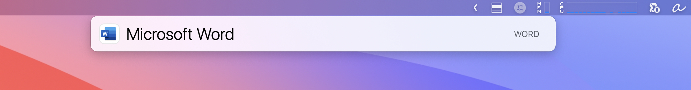

# Get Recent Microsoft Office Documents for LaunchBar

This repository provides a suite of LaunchBar [actions](https://www.obdev.at/products/launchbar/actions.html) for accessing recent Microsoft Office documents. The actions are designed to streamline access to recent files for users working with Microsoft [Excel](https://www.microsoft.com/en-us/microsoft-365/excel), [PowerPoint](https://www.microsoft.com/en-us/microsoft-365/powerpoint), and [Word](https://www.microsoft.com/en-us/microsoft-365/word).

## Contents

This repository includes the following components:

- **Actions**: Pre-packaged LaunchBar actions in `Actions.zip` to enable direct access to recent documents.
- **Source Code**:
  - **BDAlias**: Helper library for managing macOS aliases.
  - **GetRecentExcelDocuments**: Retrieves recent Microsoft Excel documents.
  - **GetRecentPowerPointDocuments**: Retrieves recent Microsoft PowerPoint documents.
  - **GetRecentWordDocuments**: Retrieves recent Microsoft Word documents.
  - **GetRecentOfficeDocumentsLib**: Shared library used across Office document retrieval actions.

## Installation

### Option 1: Manual Installation

1. **Download** the pre-packaged actions from the [Actions.zip](https://github.com/alberti42/Get-Recent-Microsoft-Office-Documents-For-LaunchBar/raw/refs/heads/main/Actions.zip).
2. **Extract** the contents, which include:
   - `Recent Excel Documents.lbaction`
   - `Recent PowerPoint Documents.lbaction`
   - `Recent Word Documents.lbaction`
3. Place these `.lbaction` files into your LaunchBar Actions folder:
   '''
   ~/Library/Application Support/LaunchBar/Actions
   '''

4. **Restart LaunchBar** to load the new actions.

### Option 2: Automatic Installation

Alternatively, you can simply double-click each `.lbaction` file. This will automatically install the action in LaunchBar.

## Compilation Instructions

To compile the `GetRecentExcelDocuments`, `GetRecentPowerPointDocuments`, and `GetRecentWordDocuments` programs from the source code, follow the steps below. Compilation from the source code should, however, not be necessary if you simply plan to use the actions.

1. **Open the Workspace**:
   - Open the Xcode workspace `GetRecentOfficeDocuments.xcworkspace`, which is located at the root of the project directory:
   '''
   open GetRecentOfficeDocuments.xcworkspace
   '''

2. **Select the Scheme**:
   - In Xcode, use the scheme selector in the toolbar to select one of the targets:
     - `GetRecentExcelDocuments`
     - `GetRecentPowerPointDocuments`
     - `GetRecentWordDocuments`

3. **Set Build Configuration**:
   - Go to **Edit Scheme** for each target and ensure the **Build Configuration** is set to `Release` for the final production build.

4. **Build the Selected Target**:
   - Select **Product > Build** to build the selected scheme. This will compile the program and place the output in the `BUILT_PRODUCTS_DIR`.

5. **Repeat for Each Program**:
   - Repeat steps 2 to 4 for each program (`GetRecentExcelDocuments`, `GetRecentPowerPointDocuments`, and `GetRecentWordDocuments`) to produce all three executables.

6. **Manual Copy to LaunchBar Actions**:
   - After building, copy each executable to its respective directory in:
     '''
     ~/Library/Application Support/LaunchBar/Actions/Recent [Application Name] Documents.lbaction/Contents/Scripts
     '''
   - Replace `[Application Name]` with `Excel`, `PowerPoint`, or `Word` as appropriate.

## Usage

- Activate LaunchBar and type the name of the desired Microsoft Office application.
- Press space to display directly from LaunchBar the recent documents of the selected Office application.

## Donations

If you find this plugin helpful, consider supporting its development with a donation.

## Author

- **Author:** Andrea Alberti
- **GitHub Profile:** [alberti42](https://github.com/alberti42)
- **Donations:** 

Feel free to contribute to the development of this plugin or report any issues in the [GitHub repository](https://github.com/alberti42/obsidian-plugins-annotations/issues).
